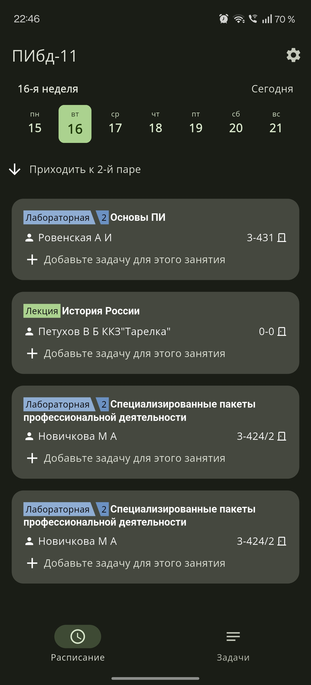
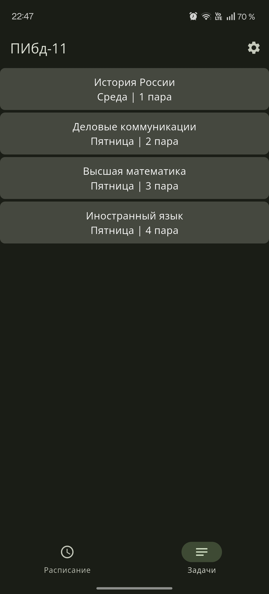
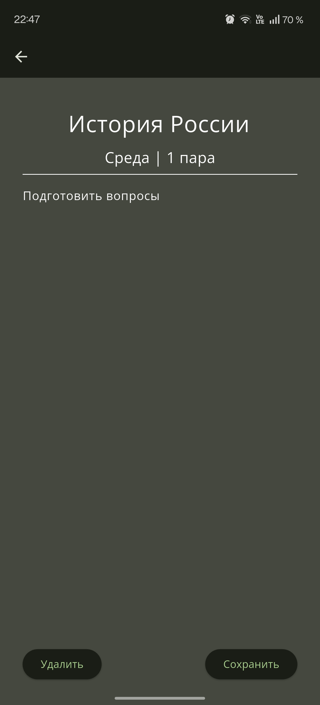
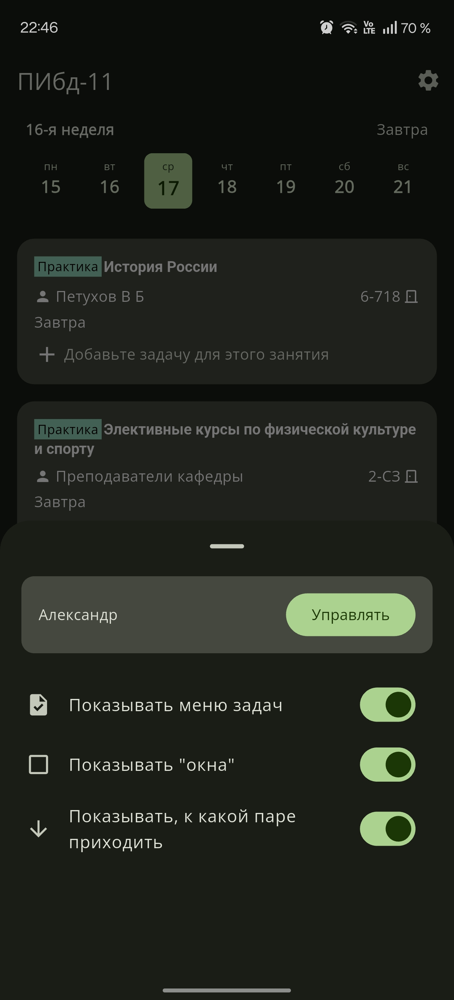

# Расписание УлГТУ

Приложение для удобного просмотра расписания **Ульяновского государственного технического университета (УлГТУ)** с поддержкой оффлайн-режима и управления учебными задачами.

Проект создан как компактное и современное решение для студентов, которым важно быстро получать актуальное расписание и фиксировать задания прямо во время пар.

## ✨ Возможности

### 📆 Расписание
- Просмотр расписания **по дням**
- Автоматическое **определение группы и подгруппы**
- Работа **в оффлайн-режиме**
- Быстрый доступ к расписанию без лишних действий

### 🔐 Аккаунт
- Вход в аккаунт
- Привязка группы и подгруппы к профилю пользователя

### 📝 Задачи
- Отдельный экран с задачами
- Сохранение заданий:
  - на **текущую пару**
  - на **следующую пару**
- Быстрое добавление задач во время занятия

### 📸 Скриншоты  

 

## 🎨 Интерфейс

- **Material 3**
- **Адаптивные цвета** (поддержка системной темы)
- Минималистичный и читаемый дизайн
- Корректное отображение на разных устройствах

## 🛠️ Технологии

- **Flutter**
- Кроссплатформенная поддержка

## 📦 Поддерживаемые платформы

- **Android**
- **Windows**
  - Installer
  - Portable

## 🚧 Статус проекта

Проект находится в активной разработке.  
Функциональность и интерфейс могут изменяться.

## 📄 Лицензия

© 2025 Alexandr Savchuk & Ilya Skvortsov. All rights reserved.

Этот репозиторий не лицензирован для свободного использования.
Любое несанкционированное копирование, распространение или модификация запрещены.
***